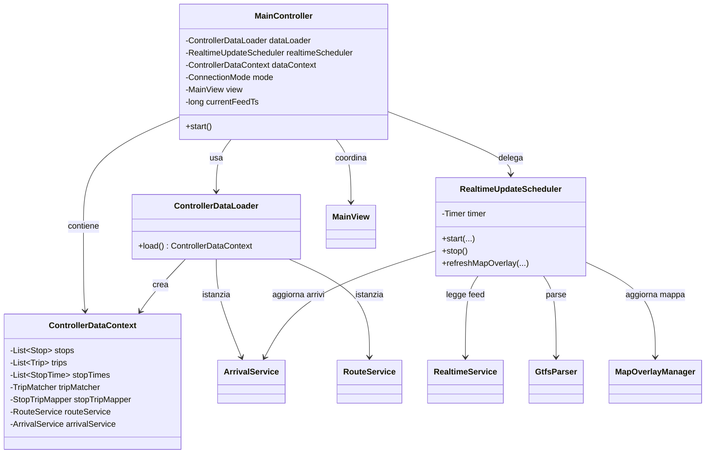
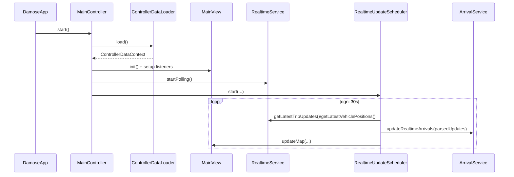

# Documentazione Progetto Damose-0.3 (IT)

## Panoramica
Damose e un tracker del trasporto pubblico basato su:
- dati **GTFS statici** (fermate, viaggi, orari);
- feed **GTFS Realtime** (TripUpdates e VehiclePositions);
- interfaccia desktop Swing con mappa interattiva.

Obiettivi principali:
- mostrare mezzi in tempo reale sulla mappa;
- mostrare tempi di arrivo stimati nel Floating Panel;
- usare fallback statico quando il realtime non e disponibile.

## Architettura ad Alto Livello
La struttura segue un modello MVC con servizi applicativi:
- `model`: entita di dominio (`Stop`, `Trip`, `StopTime`, `VehiclePosition`, ...).
- `data.loader`: parsing e caricamento dei file GTFS statici.
- `data.mapper`: matching tra ID statici e realtime (`TripMatcher`, `StopTripMapper`).
- `service`: logica applicativa (arrivi, polling realtime, routing).
- `view`: UI Swing e rendering mappa.
- `controller`: orchestrazione tra UI e servizi.

## Refactor OOP Eseguito
`MainController` gestiva troppe responsabilita (bootstrap dati, scheduling realtime, coordinamento UI).

Sono state estratte tre classi dedicate:
- `ControllerDataLoader`: carica i dati statici e costruisce i servizi.
- `ControllerDataContext`: contenitore immutabile dei dati e servizi condivisi.
- `RealtimeUpdateScheduler`: ciclo timer realtime e refresh mappa/arrivi.

Benefici principali:
- minore accoppiamento nel controller;
- responsabilita piu chiare (Single Responsibility);
- maggiore testabilita;
- manutenzione piu semplice.

## UML Class Diagram

## UML Sequence Diagram (Avvio + Primo ciclo realtime)

## Flusso Arrivi Floating Panel
1. L'utente seleziona una fermata sulla mappa.
2. `MainController` invoca `ArrivalService.computeArrivalsForStop(...)`.
3. `ArrivalService` prova il matching realtime (trip + stop), con fallback controllati.
4. Se non esiste una predizione valida, usa l'orario statico.
5. `MainView` aggiorna il Floating Panel.

## Note Tecniche
- `ConnectionMode` governa il comportamento online/offline.
- `RealtimeUpdateScheduler` evita logica realtime sparsa nel controller.
- `ControllerDataContext` centralizza il passaggio dipendenze senza statiche globali.
