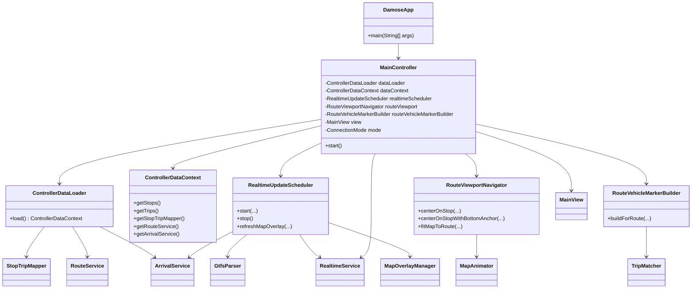
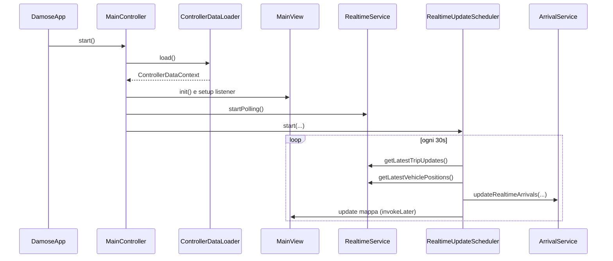

# Damose

## Come Installare?

### Opzione 1: EXE (Windows)
1. Genera i pacchetti:
```bash
mvn clean package
```
2. Crea l'installer `.exe` con `jpackage` (JDK 17 + WiX Toolset 3.x richiesti):
```bash
jpackage --type exe --name Damose --input target --main-jar damose-bus-tracker-1.0.0.jar --main-class damose.app.DamoseApp --dest target/installer
```
3. Avvia:
`target/installer/Damose-1.0.exe`

### Opzione 2: JAR (cross-platform)
1. Genera il jar eseguibile:
```bash
mvn clean package
```
2. Avvia:
```bash
java -jar target/damose-bus-tracker-1.0.0.jar
```

Nota: il file `.exe` e il `.jar` vengono prodotti in locale nella cartella `target/`.

Applicazione desktop Java per il monitoraggio del trasporto pubblico di Roma, basata su:
- dati GTFS statici (`stops`, `trips`, `stop_times`, `calendar_dates`);
- feed GTFS Realtime (`TripUpdates`, `VehiclePositions`);
- interfaccia Swing con mappa interattiva.

## Stack Tecnologico
- Java 17
- Maven 3
- Swing + FlatLaf
- JXMapViewer2
- Protocol Buffers + GTFS-RT bindings
- SQLite

## Funzionalita Principali
- Visualizzazione mezzi in tempo reale su mappa.
- Arrivi fermata con integrazione realtime/statico.
- Ricerca fermate e linee.
- Preferiti (fermate/linee).
- Modalita online/offline.
- Vista "tutte le corse del giorno" nel pannello fermata.
- Overlay info integrato con link cliccabili.
- Filtro route/vehicle migliorato per ridurre mismatch realtime.
- Rendering mappa migliorato: meno sovrapposizioni waypoint e fit linea piu stabile.

## Architettura
Il progetto segue una struttura a livelli:
- `view`: UI e componenti mappa.
- `controller`: orchestrazione flussi applicativi.
- `service`: logica di dominio e integrazione realtime.
- `data.loader` / `data.mapper`: caricamento e matching GTFS.
- `model`: entita dominio.
- `database`: persistenza utente/sessione/preferiti.

### UML Class Diagram


### UML Sequence Diagram (Avvio e primo ciclo realtime)


## Struttura Progetto (sintesi)
```text
src/main/java/damose/
  app/
  controller/
  service/
  data/loader/
  data/mapper/
  model/
  view/
  database/
```

## Avvio Locale
```bash
mvn clean compile
mvn exec:java
```

## Dati
- Feed RT:
  - `https://romamobilita.it/sites/default/files/rome_rtgtfs_vehicle_positions_feed.pb`
  - `https://romamobilita.it/sites/default/files/rome_rtgtfs_trip_updates_feed.pb`
- GTFS statico locale in `src/main/resources/gtfs_static/`.

## Documentazione Aggiuntiva
- `docs/Relazione_Tecnica.pdf`: relazione tecnica del progetto.
- `docs/javadoc/index.html`: documentazione API generata.
- `docs/ClassDiagram_Structured.pdf`: diagramma classi strutturato (versione aggiornata).
