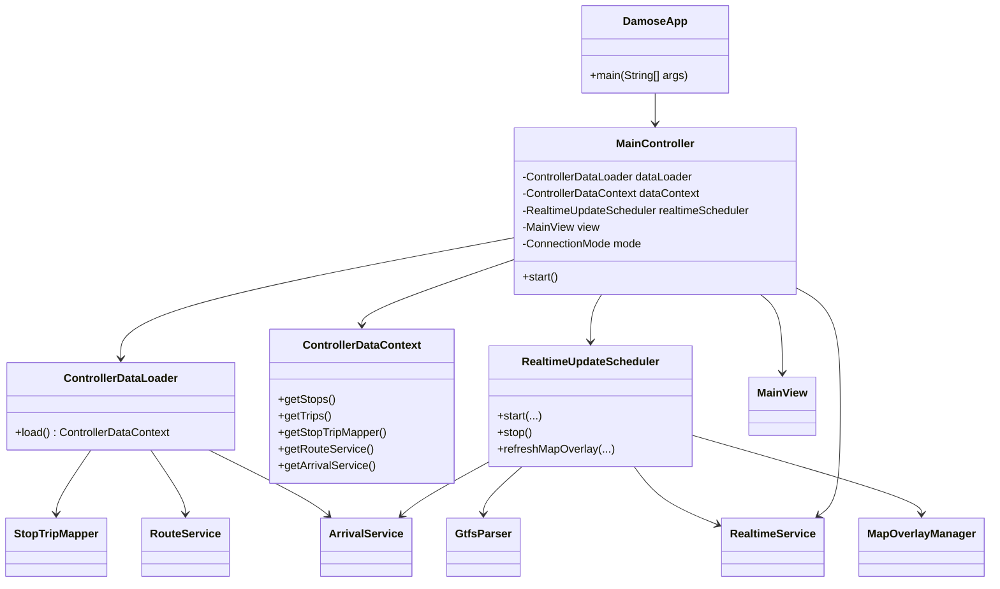
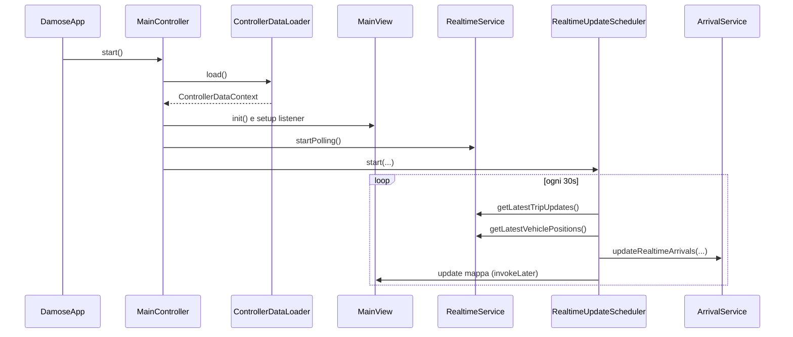

# Damose 0.3

Applicazione desktop Java per il monitoraggio del trasporto pubblico di Roma, basata su:
- dati GTFS statici (`stops`, `trips`, `stop_times`, `calendar_dates`);
- feed GTFS Realtime (`TripUpdates`, `VehiclePositions`);
- interfaccia Swing con mappa interattiva.

## Stack Tecnologico
- Java 17
- Maven 3
- Swing + FlatLaf
- JXMapViewer2
- Protocol Buffers + GTFS-RT bindings
- SQLite

## Funzionalita Principali
- Visualizzazione mezzi in tempo reale su mappa.
- Arrivi fermata con integrazione realtime/statico.
- Ricerca fermate e linee.
- Preferiti (fermate/linee).
- Modalita online/offline.
- Vista "tutte le corse del giorno" nel pannello fermata.

## Architettura
Il progetto segue una struttura a livelli:
- `view`: UI e componenti mappa.
- `controller`: orchestrazione flussi applicativi.
- `service`: logica di dominio e integrazione realtime.
- `data.loader` / `data.mapper`: caricamento e matching GTFS.
- `model`: entita dominio.
- `database`: persistenza utente/sessione/preferiti.

### UML Class Diagram


### UML Sequence Diagram (Avvio e primo ciclo realtime)


## Struttura Progetto (sintesi)
```text
src/main/java/damose/
  app/
  controller/
  service/
  data/loader/
  data/mapper/
  model/
  view/
  database/
```

## Avvio Locale
```bash
mvn clean compile
mvn exec:java
```

## Dati
- Feed RT:
  - `https://romamobilita.it/sites/default/files/rome_rtgtfs_vehicle_positions_feed.pb`
  - `https://romamobilita.it/sites/default/files/rome_rtgtfs_trip_updates_feed.pb`
- GTFS statico locale in `src/main/resources/gtfs_static/`.

## Documentazione Aggiuntiva
- `DOCUMENTAZIONE_PROGETTO_IT.md`: descrizione estesa del progetto (italiano + UML).
